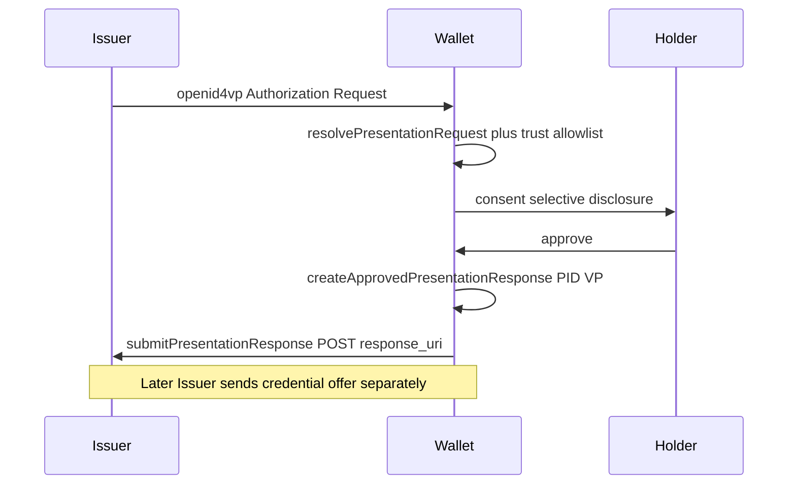

# P2 Issuer OID4VP PID presentation (handler-only)

## Decisions (locked)

- **Goal:** Wallet can create and submit a PID VP when the Issuer asks via OID4VP (sequence steps 3–7).
- **Intake:** Option 1 — only when `openid4vp://…` (or `response_type=vp_token`) arrives via deeplink / QR / future portal redirect. No sample-request generator, no Issuer mock server.
- **E2E:** Deferred until the real Issuer `response_uri` exists.
- **Protocol after VP:** Out of scope for this slice — Issuer will send the credential offer separately (existing claim path). No auth-code OID4VCI change yet.

## Approach

Reuse the **existing Verifier OID4VP path on Scan** rather than rebuilding inside [`CredentialOfferClaimScreen`](src/screens/CredentialOfferClaimScreen.tsx).

Why this approach: [`resolvePresentationRequest`](src/services/vp/presentationService.ts) / [`createApprovedPresentationResponse`](src/services/vp/presentationApproval.ts) / [`submitPresentationResponse`](src/services/vp/presentationService.ts) and Scan consent UI already implement create+submit. The gap is **trust config** (Issuer as relying party) plus docs/TASKS clarity — not a second VP stack.

Do **not** fake step 3 inside the ThaID interstitial; leave P1 mock as-is until Issuer drives real OID4VP.

## Implementation

### 1. Design spec

Write [`docs/superpowers/specs/2026-07-10-p2-issuer-oid4vp-pid-auth-design.md`](../specs/2026-07-10-p2-issuer-oid4vp-pid-auth-design.md):

- Sequence mapping (steps 3–7 Wallet; 8–18 Issuer)
- Intake = existing `openid4vp` deeplink/QR → Scan
- Trust via allowlist (same `TrustedVerifier` shape)
- One biometric prompt rule (sign-time Keychain only for signed VP / SD-JWT+KB)
- Explicit non-goals: Issuer mock, auth-code OID4VCI, Trust Registry on receive, chaining offer in same session

### 2. Issuer trust allowlist

Extend [`src/config/trustedVerifiers.ts`](../../src/config/trustedVerifiers.ts) (keep matcher reuse in [`trustedVerifierMatcher.ts`](../../src/services/vp/trustedVerifierMatcher.ts)):

- Add env-driven Issuer OID4VP entries, parallel to Verifier `did:web`:
  - `EXPO_PUBLIC_ISSUER_OID4VP_DID_WEB_CLIENT_ID`
  - `EXPO_PUBLIC_ISSUER_OID4VP_DID_WEB_RESPONSE_ORIGIN`
  - `EXPO_PUBLIC_ISSUER_OID4VP_DID_WEB_NAME` (optional)
  - `EXPO_PUBLIC_ISSUER_OID4VP_DID_WEB_JWK` (optional; JAR verify / pinned key)
- Merge into the list consumed by `resolvePresentationRequest` (same `TRUSTED_VERIFIERS` array or a thin `buildTrustedPresentationPartiesFromEnv()` that concatenates Verifier + Issuer entries — one list at the call site).
- Document vars in [`.env.example`](../../.env.example) and [`.env.development.local.example`](../../.env.development.local.example).
- Dev-only `redirect_uri:` Issuer entry only if a base URL env is set (same policy as Verifier: no redirect_uri in release).

### 3. Confirm Scan path needs no protocol fork

[`app/(tabs)/scan.tsx`](../../app/(tabs)/scan.tsx) + [`deeplinkStore`](../../src/store/deeplinkStore.ts) already route `openid4vp` → resolve → consent → approve → POST `response_uri`.

Changes only if gaps appear in tests:

- Ensure PID match still works when Issuer DCQL asks for ThaiNationalID / idcard (existing matchers).
- Friendly errors already via [`scanFriendlyErrors`](../../src/services/scan/scanFriendlyErrors.ts); extend copy only if Issuer-specific failures need clearer Thai text.
- Optional: history metadata tag `partyRole: 'issuer-auth'` vs verifier when `clientId` matches Issuer allowlist — nice-to-have, not required for send capability.

### 4. Tests (no Issuer server)

- Unit: `buildTrustedVerifiersFromEnv` / new builder includes Issuer `did:web` entry; production build policy excludes Issuer `redirect_uri` if added.
- Extend [`presentationService.test.ts`](../../src/services/vp/presentationService.test.ts): resolve + `submitPresentationResponse` against a **fetch mock** with Issuer `client_id` / `response_uri` on the allowlist (proves Wallet can POST VP body). Not a running mock Issuer.
- Deeplink routing regression: existing [`deeplinkStore.test.ts`](../../src/store/deeplinkStore.test.ts) / Scan deeplink tests still pass.

### 5. Docs / backlog

- Update [`docs/TASKS.md`](../TASKS.md): P2 identity item → Wallet handler ready; blocked on real Issuer Authorization Request + `response_uri`.
- Note in canvas or TASKS: step 3–7 Wallet send path; E2E pending Issuer API.

## Out of scope

- Mock Issuer VP-receive API under `server/`
- Authorization Code OID4VCI after VP
- Replacing P1 `ThaIdVerificationPanel` simulation
- Wallet Trust Registry / Issuer `did:web` verify on credential receive (steps 29–31)
- Per-credential `did:key` (diagram step 20) — **separate track:** [`2026-07-10-p2-per-credential-did-key.md`](./2026-07-10-p2-per-credential-did-key.md) (will supersede ADR 0009)

## Manual verify later (real API)

1. Configure Issuer OID4VP env allowlist to match real `client_id` + `response_uri` origin (+ JWK if JAR).
2. `adb shell am start … openid4vp://authorize?…` (or portal redirect) with a live Issuer request.
3. Consent → biometric at sign → confirm POST reaches Issuer; then run normal offer claim when Issuer sends it.
