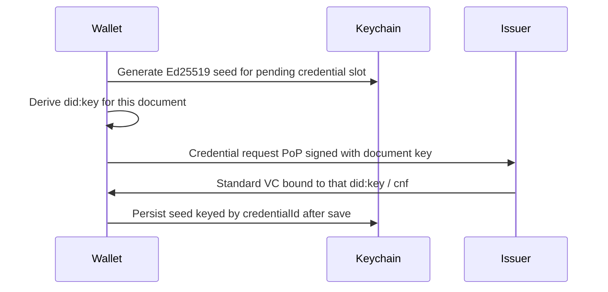

# P2 per-credential `did:key` (diagram-aligned)

**Status:** Planning only — separate from [`2026-07-10-p2-issuer-oid4vp-pid-auth.md`](./2026-07-10-p2-issuer-oid4vp-pid-auth.md).

**Product decision (2026-07-10):** Follow the P2 sequence diagram — **one new Holder `did:key` per document** at issuance (journey step 12 / expanded step 20). Do **not** keep ADR 0009’s single wallet-level key as the long-term model.

## Diagram requirement

| Step | Actor | Requirement |
|------|--------|-------------|
| 20 / journey 12 | Digital Wallet | Generate a **new** key → `did:key` **for this credential** |
| 21 | Digital Wallet | Credential request PoP signed with **that** key |
| P3 | Digital Wallet | Rotation/renewal interacts with **document** keys |
| P6 | Digital Wallet | After Issuer confirmation, may **destroy that document’s** private key |

## Current code (to replace)

- [`docs/adr/0009-wallet-level-holder-signing-key.md`](../../adr/0009-wallet-level-holder-signing-key.md) — Accepted: one Keychain Ed25519 seed for all credentials.
- [`src/services/crypto/crypto.ts`](../../../src/services/crypto/crypto.ts) — `generateWalletKeyIfNeeded`, `getHolderDid`, `signProof`, VP/KB sign all use the global seed.
- [`src/services/crypto/walletKeyRotation.ts`](../../../src/services/crypto/walletKeyRotation.ts) — rotation marks **all** credentials `renewal-required`.

## Target architecture (high level)

### Storage sketch

- **Per-credential secret:** Keychain item per document (or one Keychain store with encrypted seed map) — still biometric/device gate at sign (ADR 0008 algorithm/storage posture).
- **Index:** `credentialId` → `{ didKey, keychainServiceId }` in encrypted MMKV (no raw seed in MMKV).
- **Pending issuance:** ephemeral key slot created at claim start; committed on successful `saveCredentialRecord`; discarded on cancel/failure.

### Protocol call sites to rebind

| Flow | Today | Target |
|------|--------|--------|
| OID4VCI PoP | `signProof()` → wallet DID | `signProofForCredentialKey(pendingKey)` |
| OID4VP JWT VP / SD-JWT KB | wallet DID | key of `matchedCredential.id` |
| Holder binding check on receive | compare to wallet DID | compare to pending document DID |
| P3 `rotateWalletKey` | rotate one seed, mark all | per-doc rotate/renew or explicit “wallet unlock key” vs “document keys” split (decide in ADR) |
| P6 revoke/used | lifecycle markers only | destroy document Keychain entry when diagram requires |

## ADR work

1. **Supersede ADR 0009** with a new ADR (e.g. 0010): accept per-credential Holder Ed25519 keys for diagram compliance.
2. Keep ADR 0008 for **how** seeds are protected (Keychain + biometric at sign) — cardinality changes, not algorithm.
3. Explicitly list migration: existing credentials remain on legacy wallet DID until re-issuance / renewal.

## Non-goals (this plan)

- Issuer OID4VP PID auth (other plan).
- Trust Registry / Issuer `did:web` verify on receive.
- Hardware non-extractable WSCD (still ADR 0008 software seed unless a later ADR).

## Suggested delivery order

1. ADR 0010 + design spec (grill storage + P3/P6 semantics).
2. Crypto API: create/load/sign/destroy per `credentialId` (+ pending slot).
3. Wire OID4VCI claim path (steps 20–21).
4. Wire OID4VP + proximity to credential-bound keys.
5. P3/P6 + migration + docs/`TASKS.md`.

## Risks

- **Issuer/Verifier interop:** some stacks assume one Holder DID per wallet; confirm customer Issuer accepts a new `did:key` per credential.
- **UX:** more biometric prompts if poorly batched; keep **one prompt per user action** (sign-time gate only).
- **Blast radius:** touches crypto, VCI, VP, proximity, renewal, revoke — treat as a dedicated epic, not a drive-by in OID4VP allowlist work.
